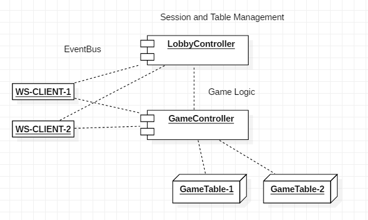

# PSMON's LightWeight WebGame Kit for Multiplayer

- run : mvn spring-boot:run
- launchurl : http://localhost:8080/

## Application Layout
- controller : endpoint for websocket and rest
- actor : There is only an actor design that works with web sockets, and you can fill in the server logic.
- thread : The server logic implemented in actor is implemented in the same way as the thread model. Comparing actor vs threads is a good comparison to understand actors.
- message : realtime message for game
- static : html5 client resources ( pure javascript )

## Server Concept

spring boot 2 + websocket + Actor

This makes it to learn web socket handles for multiplayer.

The test code available you to understand AKKA's actor model of how to create server objects and send messages.

It works perfectly integrated with Spring.

- [Spring With Akka](src/test/java/com/vgw/demo/gameweb/SpringAkkaIntegrationTest.java)
- [UnitTest for Async Message](src/test/java/com/vgw/demo/gameweb/actor)

## Client Concept

pscocos : legacy canvas library that modified cocos 2d.js by psmon -http://psmon.x-y.net/pscoco/sample.html

    This game demo is written in the old Cansvas module and pure JavaScript.
    Suitable for rapid development for prototypes, but not for official projects

## Sample Demo ( Multiplayer)

movie  : [link](http://wiki.webnori.com/display/devbegin/multiplayer-cardgame?preview=/17727533/17727532/play-demo.mp4)

## Large capacity distributed processing system

AKKA Actor and Spring Rest are easy to change to distributed processing. It is not covered in this project. Please refer to the following link

url : https://github.com/psmon/springcloud
