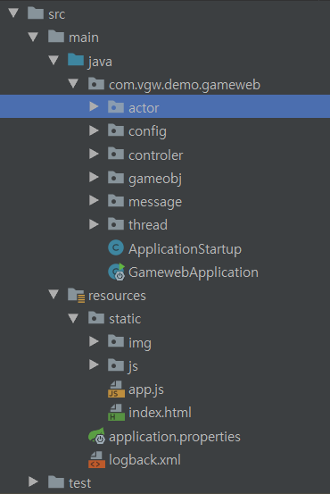

# PSMON's LightWeight WebGame Kit for Multiplayer

## Introduce

Building a simple web game framework that can play multiplayer using Spring

## Summary

- webframework : spring boot 2 / html-game
- message : websocket(storm) / actor(akka)
- run : mvn spring-boot:run
- launchurl : http://localhost:8080/
- wiki : http://wiki.webnori.com/display/webfr/Spring+with+Multiplayer+Game

## Application Layout

- controller : endpoint for websocket and rest
- actor : There is only an actor design that works with web sockets, and you can fill in the server logic.
- thread : The server logic implemented in actor is implemented in the same way as the thread model. Comparing actor vs threads is a good comparison to understand actors.
- message : realtime message for game
- static : html5 client resources ( pure javascript )

## Server Concept

spring boot 2 + websocket + Actor

This makes it to learn web socket handles for multiplayer.

- [WebSocket With Actor](src/main/java/com/vgw/demo/gameweb/actor/readme.md)
- [Java With AKKA](src/main/java/com/vgw/demo/gameweb/actor/readme.md)

## Client Concept

pscocos : legacy canvas library that modified cocos 2d.js by psmon -http://psmon.x-y.net/pscoco/sample.html

    This game demo is written in the old Cansvas module and pure JavaScript.
    Suitable for rapid development for prototypes, but not for official projects

## Sample Demo

I have implemented a simple card game sample to build this game framework.

movie  : [link](http://wiki.webnori.com/download/attachments/17727533/play-demo.mp4?version=1&modificationDate=1545660501762&api=v2)

## Other Branch

If the Master's Repository becomes usable, it will be improved through the branch.

- Improvement-Cluster : Spring cloud + Akka cluster
- Improvement-Client : TypeSafe + Morden Canvas Lib
- Spring Cloud : https://github.com/psmon/springcloud
