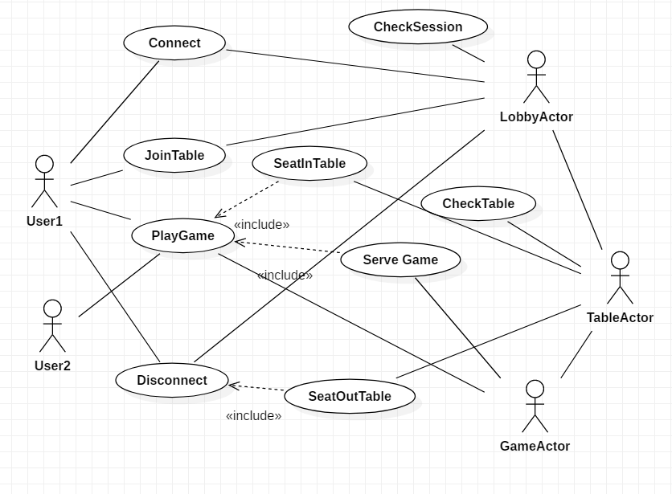
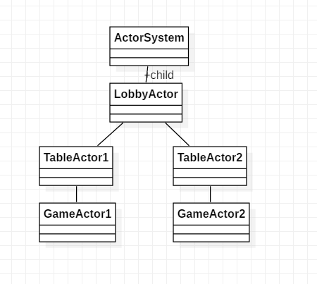
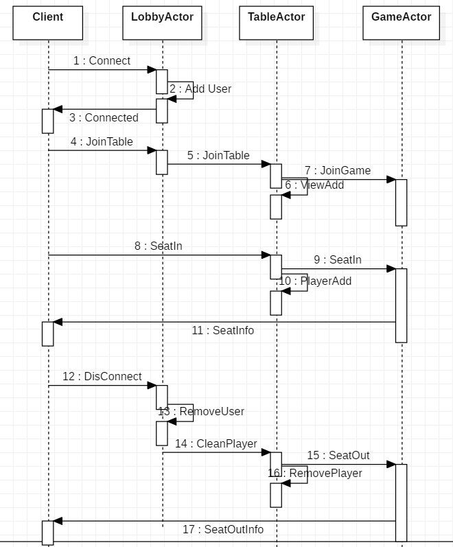

## Spring with AKKA

The test code available you to understand AKKA's actor model of how to create server objects and send messages.

It works perfectly integrated with Spring.

- [Spring With Akka](../../../../../../../../src/test/java/com/vgw/demo/gameweb/SpringAkkaIntegrationTest.java)
- [UnitTest for Async Message](../../../../../../../../src/test/java/com/vgw/demo/gameweb/actor)

## Message design by Actor

### UseCase by Actor

### Composite Structure by Actor

### Sequence by ActorMessage

### Code implementation
    @Override
    public AbstractActor.Receive createReceive() {
        return receiveBuilder()
                .match(ConnectInfo.class, c -> {
                    if(c.getCmd()== ConnectInfo.Cmd.CONNECT){
                        sessionMgr.put(c.getSessionId(),c.getWsSender());
                        log.info("user connected:"+c.getSessionId());
                    }else if(c.getCmd()== ConnectInfo.Cmd.DISCONET){
                        sessionMgr.remove(c.getSessionId());
                        Player removeUser = new Player();
                        removeUser.setSession(c.getSessionId());
     
                        if(c.getTableNo()>0){
                            findTableByID(c.getTableNo()).tell(new SeatOut(removeUser),ActorRef.noSender());
                        }else{
                            findTableALL().tell(new SeatOut(removeUser),ActorRef.noSender());
                        }
                        log.info("user disconnected:"+c.getSessionId());
                    }
                    sessionMgr.put(c.getSessionId(),c.getWsSender());
                })
                .match(TableCreate.class, t->{
                    // Create a table under the lobby, if you have an Actor named TableManagement, you can move easily.
                    String tableUID = "table-" + t.getTableId();
                    if(t.getCmd() == TableCreate.Cmd.CREATE){
                        ActorRef tableActor = getContext().actorOf( TableActor.props(t,this.getSelf() ), tableUID);
                        tableActor.tell(t,ActorRef.noSender());
                    }
                })
                .match(JoinGame.class, j->{
                    joinGameTable(j.getTableId(),j.getName(),j.getSession());
                })
                .match(MessageWS.class, m->{
                    send(m.getSession(),m.getGameMessage());
                })
                .build();
    }

### Usage by Actor

    ActorSelection lobbyActor = system.ActorSelection("user/lobby");
    lobbyActor.tell("some message",null);
     
    ActorSelection tableAllActor = system.ActorSelection("user/lobby/table/*");
    tableAllActor.tell("some message",null);

Other Links

- https://doc.akka.io/docs/akka/2.5/general/addressing.html
- https://www.baeldung.com/akka-with-spring
- https://getakka.net/articles/intro/what-are-actors.html
- http://alexminnaar.com/introduction-to-the-multithreading-problem-and-the-akka-actor-solution.html
