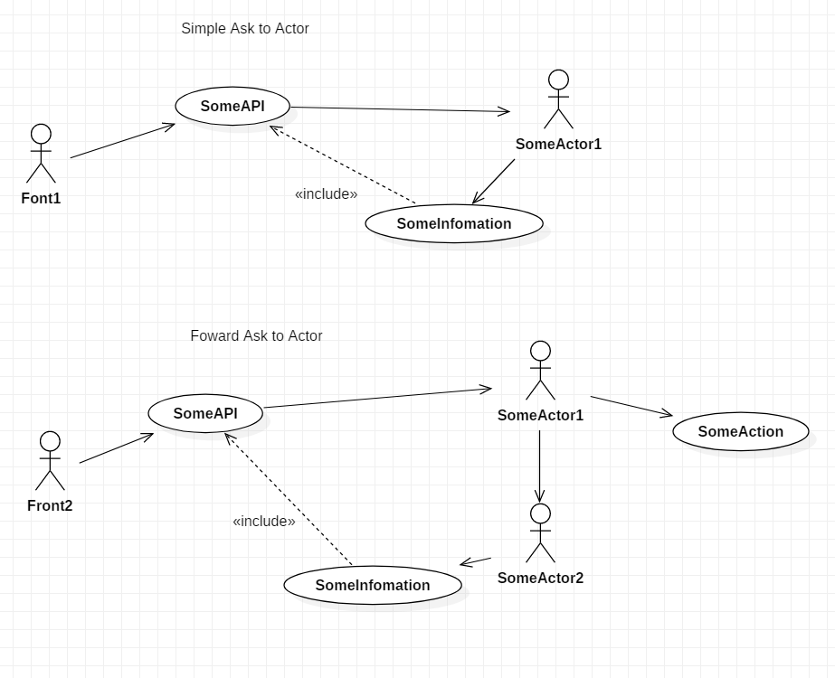
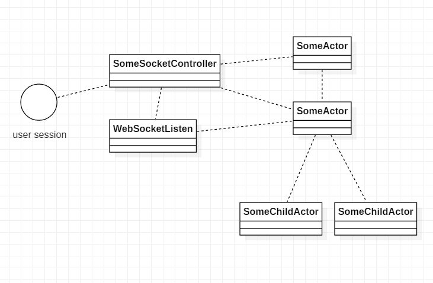

## RestAPI with ActorMessage

    @RequestMapping("/gameinfo/dealer/{gameId}")
    int getDealer(@PathVariable String gameId) {
        try{
            String actorPath = "user/lobby/table-" + gameId;
            ActorSelection tableActor = system.actorSelection(actorPath);
            return (int)AkkaUtil.AskToActorSelect(tableActor,new TableInfo(TableInfo.Cmd.DealerPos),1);
        }catch (Exception e){
            logger.error(e.toString());
            return -100;
        }
    }
    
## Webocket with Actor

    @MessageMapping("/game.req")
    @SendTo("/topic/public")
    public GameMessage gameReq(@Payload GameMessage gameMessage,
                               SimpMessageHeaderAccessor headerAccessor) {

    //ACTOR
    // Received Socket Message -> SomeActor
    if(gameMessage.getType()== GameMessage.MessageType.GAME){
        switch (gameMessage.getContent()){
            case "join":{
                int ftableNo = gameMessage.getNum1();
                headerAccessor.getSessionAttributes().put("tableNo",ftableNo);
                ActorSelection lobbyActor = system.actorSelection("user/lobby");
                lobbyActor.tell(new JoinGame(ftableNo,userName,userSession),ActorRef.noSender() );
            }

    }
